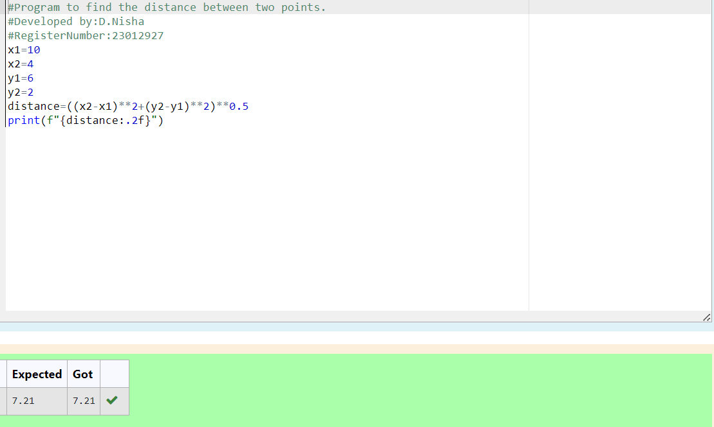

# DISTANCE-BETWEEN-TWO-POINTS

## AIM:
To write a python program to find the distance two 2 points
## ALGORITHM:
### Step 1: 
write your name and register number.
### Step 2:
assign four values for four variables. 
### Step 3: 
Substitute the values in the distance formula  
### Step 4: 
give print statement.
### Step 5: 
execute the program.
### PROGRAM:
```
# Program to find the distance between two points.
# Developed by:D.Nisha 
# RegisterNumber:23012927
x1=10
x2=4
y1=6
y2=2
distance=((x2-x1)**2+(y2-y1)**2)**0.5
print(f"{distance:.2f}")
```
## OUTPUT:


### RESULT:
the distance between two points are calculated and executed successfully.
